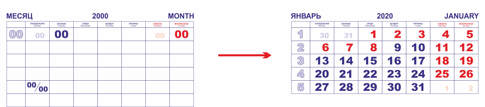

# Kvart
Макрос для CorelDraw 16 (проверена работа в 21). Генерирует сетки для квартального календаря на основе шаблона.

## Принцип работы
Макрос берёт шаблон, состоящий из одной странички и создаёт из него новый документ такого же размера, но состоящий из 14 страниц: декабрь предыдущего года, 12 месяцев года календаря и январь следующего. Всё содержимое дублируется как есть, включая слои, изменяются только специально помеченные элементы, по которым макрос строит сетку. Сетка может быть как стандартной пятистрочной (с дробью для не помещающихся дней месяца), так и шестистрочной. Редактированием шаблона можно построить вообще произвольную сетку. Могут быть убраны ненужные элементы (дни предыдущего/следующего месяца, номера недель). Выделяются основные праздничные дни РФ. Опционально на каждый месяц можно добавить уменьшенные сетки предыдущего/следующего месяца.

## Установка
Копируем `elvin_Kvart.gms` в папку `%APPDATA%\Corel\CorelDRAW Graphics Suite X6\Draw\GMS\`
Папку `шаблоны` можно разместить в любом удобном месте.

## Использование
Можно взять один из готовых шаблонов, поменять год в шаблоне на нужный, и запустить макрос. Макрос создаст календарь в новом документе. Шаблоны используют стандартные системные шрифты, так что с этим проблем возникнуть не должно.

## Устройство шаблона
Файл-шаблон состоит из элементов дизайна, которые не задействуются в работе макроса, и из специальных объектов, имеющих имена. Имена можно увидеть в Object manager'е. Это год календаря, название месяца на русском, название на английском, шаблон номера недели, шаблон обычного дня, шаблон выходного/праздничного дня, шаблон дня предыдущего/следующего месяца и он же для выходного/праздника, а так же шаблон дробного дня. Кроме того, на странице-шаблоне есть 6 рамок для номера недели и 42 рамки для дней - эти рамки нужны для позиционирования элементов шаблона. Макрос находит объекты по именам. Шаблонные элементы раскладываются по рамкам так же, как они стоят относительно своих изначальных рамок. Все цвета, размеры, выключка текста - сохраняются.

Названия элементов шаблона и соответсвующие им изначальные рамки:
* `YEAR` - год, для которого создаётся календарь
* `MONTH_RU` - текущий месяц на русском
* `MONTH_EN` - текущий месяц на английском *(опциональный)*
* `MONTH_NUM` - номер текущего месяца *(опциональный)*
* `WEEK_NUM` - номер недели *(опциональный)*
* `DAY_NUM` - будний день - рамка `DAY_FRAME_2`
* `SUN_NUM` - выходной/праздничный день - рамка `DAY_FRAME_7`
* `SMALLDAY_NUM` - будний день предыдущего/следующего месяца *(опциональный)* - рамка `DAY_FRAME_1`
* `SMALLSUN_NUM` - выходной/праздничный день предыдущего/следующего месяца *(опциональный)* - рамка `DAY_FRAME_6`
* `DAY_DUB` - группа, внутри два именных элемента: `NUM_TOP` и `NUM_BOT` (верхний и нижний дни) - дробный день месяца *(опциональный)* - рамка `DAY_FRAME_29`
* `PREV_MONTH_FRAME`, `NEXT_MONTH_FRAME` - рамки предыдущего/следующего месяца *(опциональные)*. На эти места после завершения генерации сетки копируются предыдущий/следующий месяц соответственно, становятся по центру и пропорционально вписываются по ширине или высоте.

Опциональные элементы можно убрать из шаблона - календарь сгенерируется без них. При удалении одного из шаблонов для дней предыдущего месяца, календарь сгенерируется без них. Если убрать дробный день, то сгенерируется шестистрочный календарь без дробных дней. Если генерируется обычный календарь - то нижние незадействованные рамки убираются макросом - можно также убрать на шаблоне вручную.

При доработке/создании шаблона сетки важно сохранять или присваивать заново имена вышеуказанным элементам. Кроме того, важно сохранять одинаковый размер рамок. Сами рамки можно как закрашивать, так и делать бесцветными, если дизайн сетки не предусматривает квадратиков под числами.

Все названия и номера рамок вынесены в константы макроса, при необходимости их можно изменить.

Все прочие элементы дизайна просто дублируются на каждой странице. Если элементы дизайна находятся на мастер-слое - то они так и остаются на нём, тем самым сохраняется гибкость готового файла. Именно так и устроены шаблоны, идущие в комплекте: все элементы дизайна в них вынесены на мастер-слой. Также некоторые шаблоны имеют цветовые стили для основных элементов, таким образом можно оперативно менять цвета во всех сетках.

## Видеоролик

Установка, использование, создание своего шаблона: https://youtu.be/c98HWXdhWSs